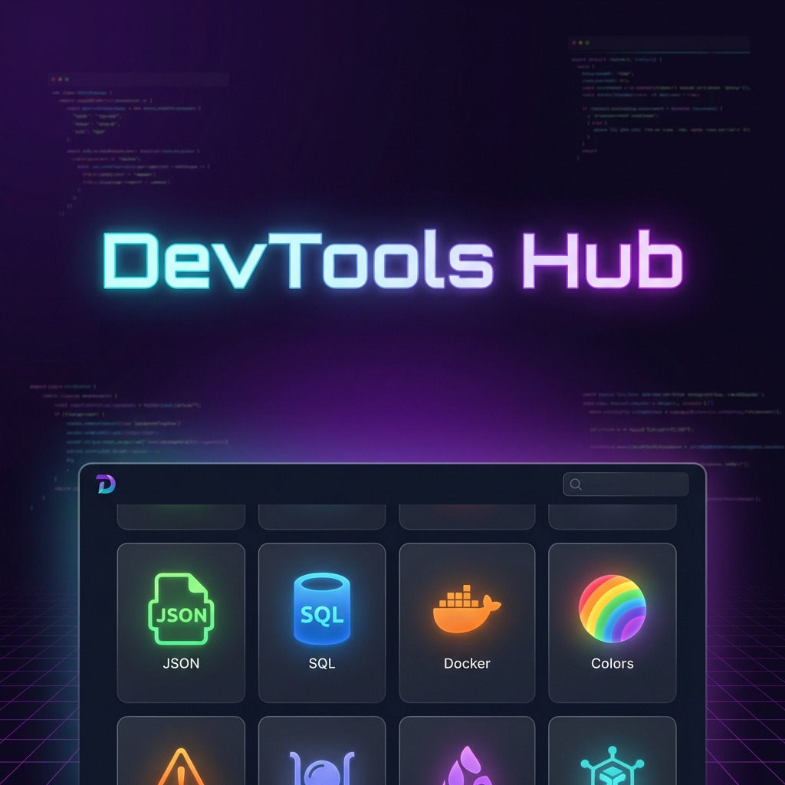

# Dev Tools Hub 🛠️



A collection of essential developer tools gathered in one place. **Fast, free, and runs entirely on the client-side** (no data is sent to any server), ensuring your data remains private and secure.


## ✨ Features

- **🔒 100% Client-Side:** No backend processing. Your JSON, JWTs, and passwords never leave your browser.
- **⚡ Fast & Responsive:** Built with React and Vite for instant load times.
- **🌙 Dark Mode:** Easy on the eyes for late-night coding sessions.
- **⭐ Favorites & Popular Tools:** Pin your favorites or quickly access popular utilities.
- **📝 Live Markdown Editor:** Full-featured GitHub-flavored markdown editor with split view.
- **📱 Mobile Friendly:** Fully responsive design.

## 🧰 Available Tools

### Text & Data
- **JSON Formatter:** Prettify, minify, and validate JSON data.
- **Base64 Converter:** Encode and decode strings/files to Base64.
- **URL Encoder:** Encode/Decode URL parameters safely.
- **Lorem Ipsum:** Generate placeholder text with custom paragraph settings.
- **Markdown Preview:** Real-time Markdown editor with formatting toolbar and split view.

### UI & Graphics
- **Gradient Generator:** Create beautiful linear and radial gradients visually.
- **Box Shadow Generator:** Design CSS box shadows with ease.
- **Color Converter:** Convert between HEX, RGB, HSL, and CMYK with a color picker.
- **SVG Optimizer:** Minify and clean up SVG code.
- **QR Code Generator:** Generate QR codes for any text or URL.

### API & DevOps
- **Chmod Calculator:** Calculate numeric (755) and symbolic (rwxr-xr-x) permissions.
- **Cron Generator:** Generate and explain cron schedule expressions.
- **SQL Formatter:** Prettify SQL queries for Standard SQL, MySQL, PostgreSQL, etc.
- **Dockerfile Generator:** Create starter Dockerfiles for Node, Python, and Go.

### Security & Crypto
- **Password Generator:** Generate strong, random passwords with entropy strength estimation.
- **Hash Generator:** Calculate MD5, SHA-1, SHA-256, and SHA-512 hashes.
- **JWT Decoder:** Decode JSON Web Tokens to inspect headers and claims without verifying the signature.
- **UUID Generator:** Generate random Version 4 UUIDs in bulk.

### Development & Utils
- **Regex Tester:** Test regular expressions against text with real-time highlighting.
- **Timestamp Converter:** Convert between Unix timestamps and human-readable dates.
- **CSS Unit Converter:** Convert between Pixels (px) and REMs based on root font size.

## 🚀 Getting Started

To run this project locally on your machine:

### Prerequisites
- Node.js (v16 or higher)
- npm or yarn

### Installation

1. **Clone the repository**
   ```bash
   git clone https://github.com/Pheem49/Developer-Utilities.git
   cd Developer-Utilities
   ```

2. **Install dependencies**
   ```bash
   npm install
   # or
   yarn install
   ```

3. **Start the development server**
   ```bash
   npm run dev
   # or
   yarn dev
   ```

4. Open your browser and navigate to `http://localhost:5173`

## 🛠️ Tech Stack

- **Framework:** [React](https://reactjs.org/) + [Vite](https://vitejs.dev/)
- **Language:** [TypeScript](https://www.typescriptlang.org/)
- **Styling:** [Tailwind CSS](https://tailwindcss.com/)
- **Icons:** [Lucide React](https://lucide.dev/)
- **Utils:** `marked` (Markdown), `blueimp-md5` (Hashing)

## 🤝 Contributing

Contributions are welcome! If you have an idea for a new tool or want to improve an existing one:

1. Fork the project.
2. Create your feature branch (`git checkout -b feature/AmazingNewTool`).
3. Commit your changes (`git commit -m 'Add some AmazingNewTool'`).
4. Push to the branch (`git push origin feature/AmazingNewTool`).
5. Open a Pull Request.

## 📄 License

This project is open source and available under the [MIT License](LICENSE).

---

Made with ❤️ for developers by developers.
